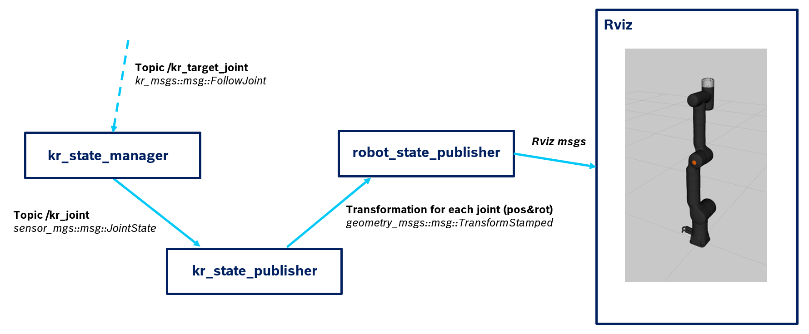
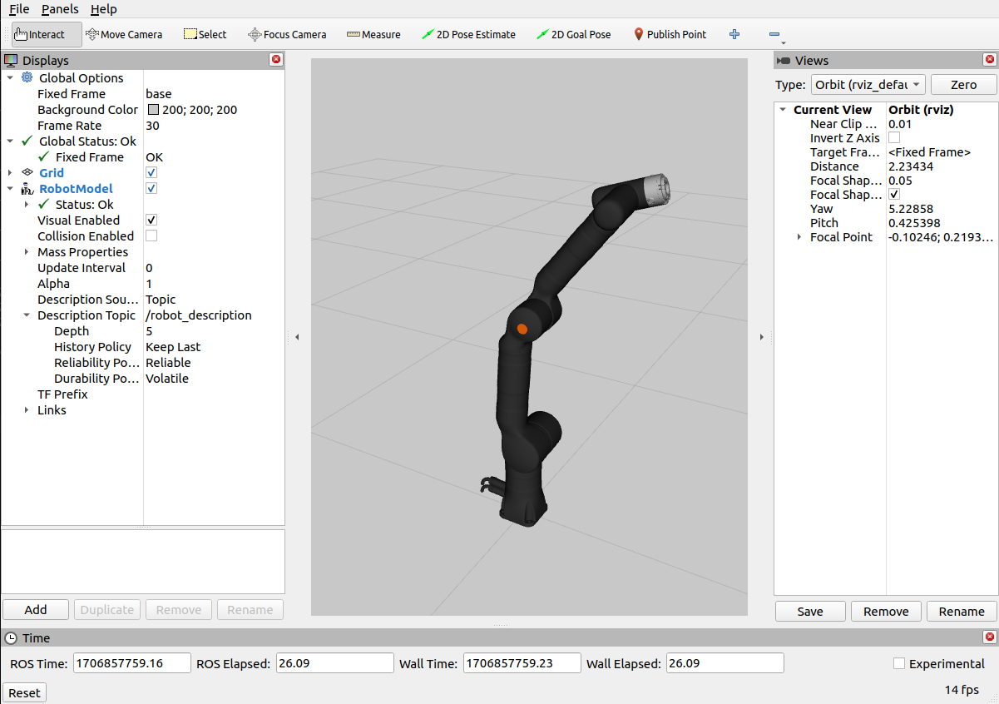

# kr_rviz_demo

This ROS2 Humble package includes a visualization interfce for the KR810 robot from Kassow Robots. 

## Authorship
Author: Raul Cruz-Oliver

Date and place: January 2024, Switzerland

Contact: raul.cruz.oliver@gmail.com

## System overview
The following image depicts the communication structure.

.

There are 4 main nodes:

- <strong>kr_state_manager</strong>: resposible for computing the current position of the 7 joints. Currently it computes an articial time series for each joint. It will eventually listen to the topic /kr_target_joint. This node is implemented in this package.

- <strong>kr_state_publisher</strong>: resposible to read the topic /kr_joints with the current position of th 7 joints and publish the respective transforms. This node is implemented in this package.

- <strong>robot_state_publisher</strong>: resposible for communicating to rviz de joint transforms that are published. This node is defined in a ROS2 official package of the same name. 

- <strong>rviz</strong>: resposible for handling the visualization. This node is defined in the ROS2 official packages.


## Run this project

### 1. Set up a ros2 workspace
Follow the official guidelines

### 2. Clone this project 
Clone this project in the source folder
```bash
cd ~/<workspace>/src

git clone https://github.com/rcruzoliver/kr_rviz_demo
```

### 3. Colcon build
```bash
rm -r install/ build/ log/
source /opt/ros/humble/setup.bash

colcon build --mixin release
```

### 4. Launch the demo
```bash
cd ~/<workspace>
source /opt/ros/humble/setup.bash
source install/local_setup.bash 

ros2 launch kr_rviz_demo kr_rviz_demo.launch.py
```

You should see the robot jogging its joints:
.